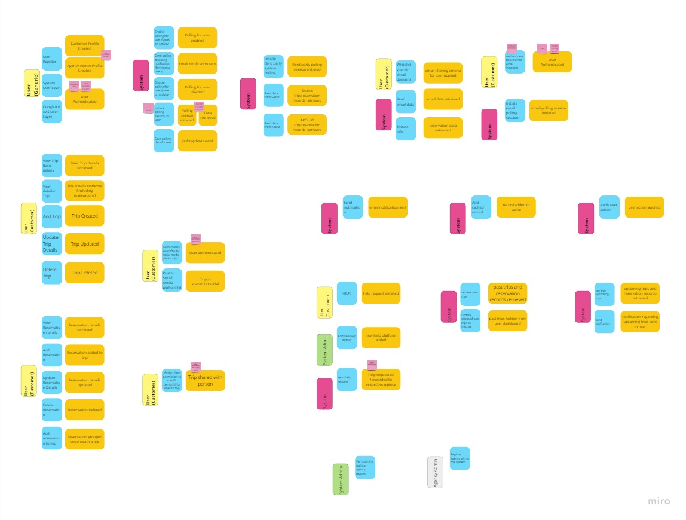
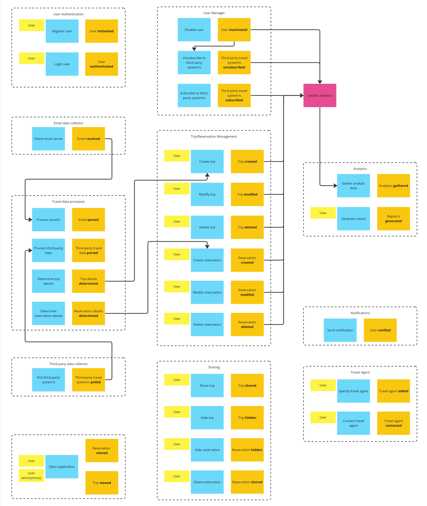
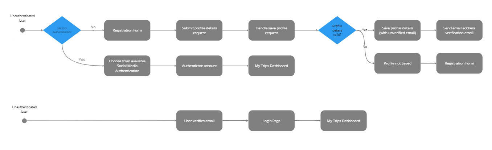
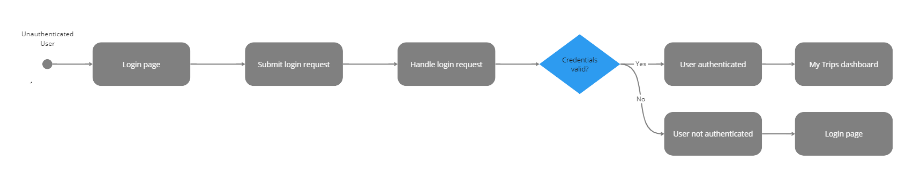
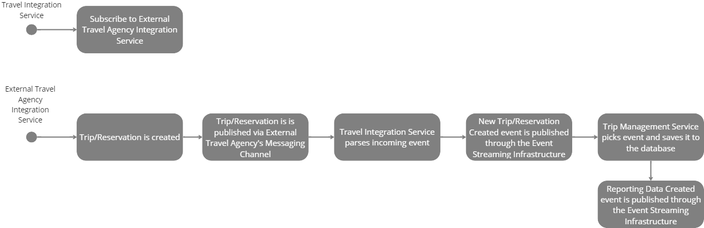
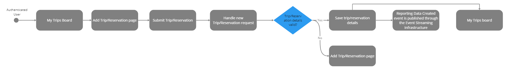
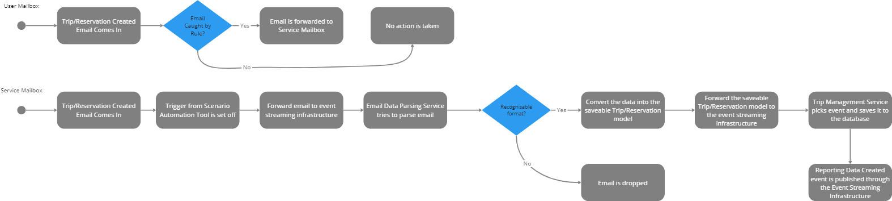
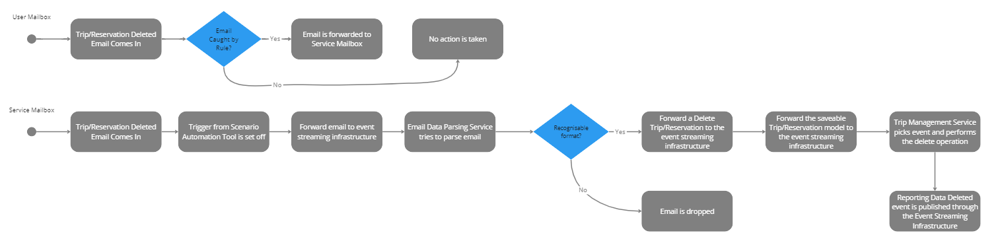
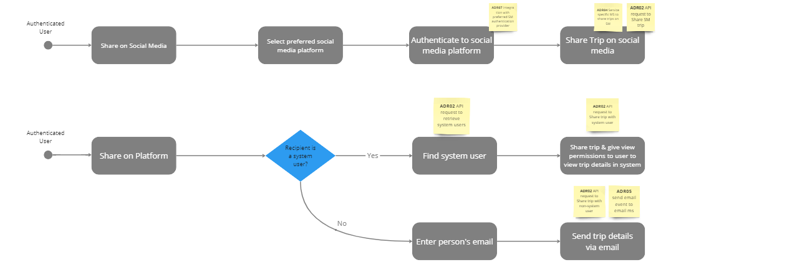
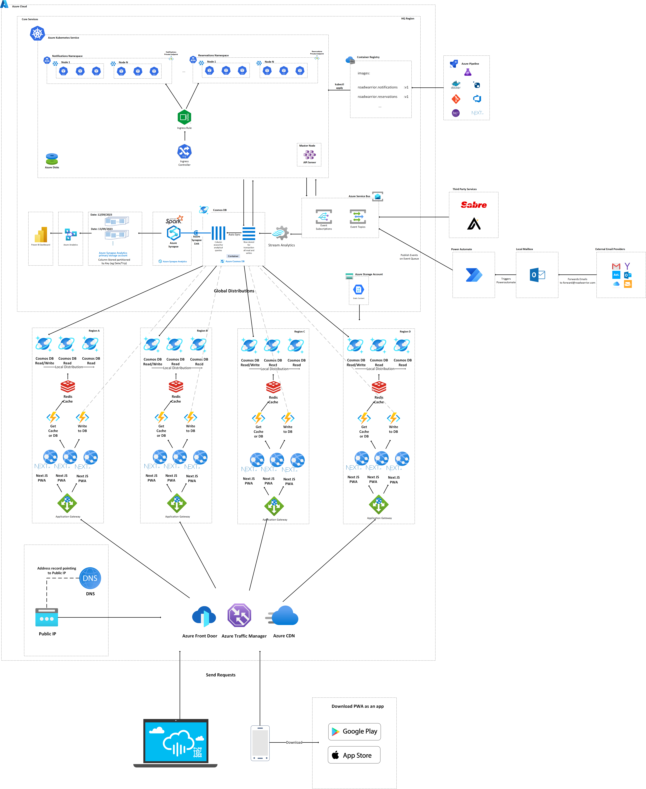

# O'Reilly Architecture Katas 2023

Team Members:  
- Karl Farrugia
- Romario Grech
- Nathan Povo
- Steve Stellini
- Muhammad Hamid Mughal

## Contents
- [Prelude](#prelude)
- [Business Case](#business-case)
  - [Requirements](#requirements)
    - [Breaking down the requirement slides](#breaking-down-the-requirement-slides)
    - [Performance Characteristics](#performance-characteristics)
  - [Technical Constraints](#technical-constraints)
  - [Business Constraints](#business-constraints)
  - [Assumptions](#assumptions)
- [Overall Platform Context](#overall-platform-context)
  - [Component Identification (Boundary Analysis)](#component-identification-boundary-analysis)
- [User Roles](#user-roles)
- [User Experience](#user-experience)
- [Actor to System Boundary Diagram](#actor-to-system-boundary-diagram)
- [User Interface Mockups](#user-interface-mockups)
  - [Manual Wireframing](#manual-wireframing)
  - [Figma Designs](#figma-designs)
- [Architecture Characteristics](#architecture-characteristics)
  - [Driving Characteristics](#driving-characteristics)
  - [Implicit Characteristics](#implicit-characteristics)
  - [Other Considerations](#other-considerations)
- [Architecture Implementation Styles](#architecture-implementation-styles)
  - [Microservices Architecture](#microservices-architecture)
  - [Event-Driven Architecture](#event-driven-architecture)
  - [Space-Based Architecture](#space-based-architecture)
  - [High Level Combined Architecture](#high-level-combined-architecture)
- [Identifying Architectural Quanta](#identifying-architectural-quanta)
  - [Kubernetes](#kubernetes)
    - [Container Registry](#container-registry)
  - [Event Bus](#event-bus)
  - [RPA - PowerAutomate](#rpa---power-automate)
  - [Next JS](#next-js)
  - [Cosmos DB](#cosmos-db)
  - [Redis](#redis)
  - [Serverless Functions](#serverless-functions)
  - [Load Balancing](#load-balancing)
    - [Azure Traffic Manager](#azure-traffic-manager)
    - [Azure CDN](#azure-cdn)
    - [Azure Front Door](#azure-front-door) 
- [Overall Architecture](#overall-architecture)
- [Platform Roadmap](#platform-roadmap)
- [Engineering Practices](#engineering-practices)
- [ADRs](#adrs)
- [Resources](#resources)
- [Our 3rd party integrations](#our-3rd-party-integrations)
  
## Prelude

Road Warrior is a startup which is poised to revolutionise the travel industry by developing a cutting-edge online trip management platform dedicated to providing travelers with dynamic and manual itinerary management capabilities. This innovative dashboard will empower travelers to effortlessly access and organise all their existing reservations, ensuring a seamless and hassle-free travel experience. Whether users prefer to access it through a web interface or on their mobile devices, this platform will serve as the go-to solution for travelers seeking comprehensive trip management solutions. With this pioneering tool, travelers can look forward to a more organised, convenient, and enjoyable journey, making it the next generation's must-have travel companion. In addition to its user-centric features, this platform will also harness the wealth of data it collects for invaluable reporting purposes. By leveraging this data, travelers will gain insights into their travel patterns, preferences, and spending habits, allowing them to make more informed decisions for future trips. As the platform continues to accumulate user data, it will lay the foundation for a future suggestion engine. 

## Business Case

### Requirements

The provided requirements can be found [here](/Resources/1_RequirementsAnalysis/Requirements.pptx)

#### Breaking down the requirement slides

To comprehensively address the requirement outlined in the brief, it is crucial to break it down into specific entry points and clearly define the payloads we will receive from each of these entry points. This meticulous approach ensures that we understand and manage the data flow effectively. 

#### Performance Characteristics

- Updates must be in the app within 5 minutes of an update (better than the competition). This may be tackled with having the latest updates locally and at the core but have eventual consistency across different regions.
- The system may be composed in 2: 
    - Core services - A stand alone kubernetes cluster which is hosted in the region of the business' core user base.
        - Different components have different loads
    - Globally distributed APIs to service read/write operations to their user base.
        - Different loads in different regions
        - Each region will have its own peak, which may be seasonal (summer holidays) or on weekly trends (weekend getaways)

### Technical Constraints

- The startup excels in its business domain but lacks the technical expertise needed for its ambitious projects. Therefore, as technical supplier we have a blank slate to start from.

### Business Constraints

- This is a start up therefore funds may be limited and have to be generated from the application itself.

### Assumptions

- Start up does not have any technical partners
- The start up will start maturing with the system MVP roll out thereby allowing the system to grow. It is assumed that if the application is not performing well the owners will take a fail fast approach and may pull the plug. Therefore, the final product while will take into consideration the cost will also assume that the application is now self sustaining.

## Overall Platform Context

The event storming process was employed to identify essential "domain events" within a system, where each event represents an action related to a business entity. It's a crucial initial step as these events configure the central artifact for the system. Event storming meetings start with participants noting domain events, foundational for defining business rules. The team wrote down domain events, each represented on an orange sticky note on a virtual whiteboard. This collaborative approach facilitates comprehensive understanding and mapping of system events for stakeholders.

Following the identification of domain events, the next step involves pinpointing the commands and users responsible for triggering these events. Commands are actions initiating these events. External actors' commands are explicitly recognized, while some commands originate internally. Post-it notes are arranged to visualize a sequence: actor, command, and event, ensuring a cohesive representation of the system's flow. This step streamlines the understanding of event triggers and user interactions.   These commands and domain events are grouped into related aggregates.

In the final step, post-gathering domain events and defining triggering commands, the focus shifts to automation policies. These policies apply to commands lacking external actors, activated upon the completion of specific domain events, signifying communication ties between bounded contexts. By grouping semantically related aggregates, we define bounded contexts. Visualized in a diagram, these boundaries and event-driven connections take shape.

### Component Identification (Boundary Analysis)

Our solution adheres to a boundary analysis that encompasses several key components to ensure its functionality and effectiveness:

- Trips and Reservations: At the core of our system lies the ability to manage trips and reservations seamlessly. Users can create, update, and view their travel itineraries, which include flights, hotels, and activity reservations.

- Polling Mechanism: To keep information up-to-date, our solution employs a polling mechanism. It regularly checks external sources such as booking platforms for any changes or updates to reservations and synchronizes them with the user's itinerary.

- Email Webhooks: For real-time communication and updates, our system integrates with email webhooks. Users receive notifications and updates about their reservations directly in their email, ensuring they stay informed and can make timely adjustments to their plans.

- Data Analytics: The solution incorporates data analytics to derive insights from user interactions, helping to improve user experiences and provide personalized recommendations based on historical travel data.

- Recommendation Engine: Utilizing a recommendation engine, our system offers tailored suggestions to users based on their travel history, preferences, and current bookings, enhancing their travel planning and decision-making process.

- User Authentication: Security is paramount, and our system includes robust user authentication mechanisms to protect user data and ensure only authorized access to accounts and itineraries.

- Third-party Integrations: We integrate with various third-party services and APIs for booking and reservation data, enabling users to seamlessly import and manage their travel information.

By adhering to this boundary analysis, our solution provides a comprehensive and user-centric travel management experience, ensuring efficiency, accuracy, and user satisfaction throughout the journey planning process.

## User Roles

The identified actors and their actions are as follows:

| Actor          | Actions |
| -------------- | ------- |
| Customer (Authenticated)      | - Registers on the platform  - Logs in the platform  - Consent to email forwarding  - View upcoming trips  - Manage upcoming trips  - View trip reservations  - Manage trip reservations  - Receives notifications regarding upcoming trips  - View personalised analytics  - Request for help from agency  - Share trip details on preferred social media platform  - Share trip details with platform  - Share trip details with anonymous user  |
| Customer (Not Authenticated) | - View shared Trip Summary|
| System Admin   | - Registers on the platform  - Logs in the platform  - Add multi-lingual translations   - View regional analystics   |

## User Experience

Delving deeper into the process outlined in [Breaking down the Requirements](#breaking-down-the-requirement-slides):

1. User Registration:

    - Entry Point: The user registration page on the website or mobile app.
    - Payload: User-provided information such as name, email, username, and password.

      

2. User Login:

    - Entry Point: The login page or API endpoint for authentication.
    - Payload: User credentials, typically comprising a username/email and password.

      

3. Booking Reservations:

    - Entry Point: Online reservation systems or APIs for flights, hotels, and activities.
    - Payload: Reservation details including dates, times, locations, and confirmation numbers.

      

4. Profile Updates:

    - Entry Point: User profile settings in the app or website.
    - Payload: User-modified data, such as profile picture, contact information, or travel preferences.

5. Trip/Reservation Creation:

    - Manual Creation
        - Entry Point: A feature allowing users to create and organize trips and reservations.
        - Payload: User-generated trip data, which includes trip names, descriptions, and associated reservations.

        

    - Automated Creation Email 
        - Entry Point: Automated creation of trips or reservations by listening to incomping emails.
        - Payload: System-generated trip data, which includes trip names, descriptions, and associated reservations based off email content.

        

6. Trip/Reservation Deletion:

    - Deleate Updates
        - Entry Point: A feature allowing users to manually delete trips and reservations.
        - Payload: User-generated trip data, and manually outlined associated reservations based off email content.   
    
          

    - Automated Email 
        - Entry Point: Automated deletion of trips or reservations by listening to incomping emails.
        - Payload: System-generated data and automatically outlined associated reservations based off email content.   

          

    - Third-Party Integration 
        - Entry Point: Polling of third-party services to scan for removed reservations.
        - Payload: System-generated data and automatically outlined associated reservations based off polled content.    

          

7. Trip/Reservation Updates:

    - Manual Updates
        - Entry Point: A feature allowing users to manually update trips and reservations.
        - Payload: User-generated trip data, and manually outlined associated reservations based off email content.   
    
          

    - Automated Email 
        - Entry Point: Automated updates of trips or reservations by listening to incomping emails.
        - Payload: System-generated data and automatically outlined associated reservations based off email content.   
        
          

    - Third-Party Integration 
        - Entry Point: Polling of third-party services to scan for updates to reservations.
        - Payload: System-generated data and automatically outlined associated reservations based off polled content.    

          

8. Itinerary Viewing:

    - Entry Point: The user's dashboard displaying their trip itineraries.
    - Payload: Itinerary information, aggregating reservations for a specific trip.

9. Trip Sharing:

    - Entry Point: The user shares a trip which is the accessed by other user's who can then join the trip
    - Payload: Itinerary information, aggregating reservations for a specific trip.

      
    
10. Data Analytics:

    - Entry Point: Backend analytics processes that examine user behaviour and preferences.
    - Payload: Analytical data, such as usage statistics, user interactions, and travel patterns.

11. Recommendation Engine:

    - Entry Point: The recommendation engine component of the system.
    - Payload: User data used for analysis, which includes historical travel data, preferences, and behaviour.

By breaking down the requirement into these distinct flows with entry points and their associated payloads, we can ensure that we have a clear understanding of where data enters the system and what information is being processed. This structured approach not only aids in the design and development of the system but also lays the foundation for effective data management, security, and the eventual implementation of analytics and recommendation features.

## Actor to System Boundary Diagram

The below actor to system boundary diagram expands on the detail provided by the High-level Platform Context Diagram (insert link here), by describing communication methods between different components (now broken down into services, providers and external tools) as well as their utilisation of infrastructure components such as databases and messaging/event channels to realise the features offered by the system.

## User Interface Mockups

Mock-ups are essential in the development process of the solution since it allows the team to visualise and conceptualise the idea. It also allows us to take a user-centred approach which aligns with the requirements. 

### Manual Prototyping

The first approach for prototyping is the traditional pen and paper with the results being show cased hereunder.

### Figma Prototyping

After the manual prototyping the next flow was to do a Figma design of the solution with the results being hereunder.

https://github.com/KarlFarrugiaIcon/OreillyKatas2023/assets/91567864/99460df7-7392-4e82-ba34-daa91e1c5cab

## Architecture Characteristics

This section takes into consideration how the architecture is to be split using the [Developer to Architect Architecture Resource](https://developertoarchitect.com/resources.html). This is intend to outline key architectural attributes we deem essential for a successful system implementation.

### Driving Characteristics

| Preferred | Characteristics | Reason |
| ----------- | ----------- | ----------- |
| [X] | Scalability | The system needs to be highly scalable since it needs to grow to accommodate increased demand and workload. This scalability is essential in the context of the solution, as travel-related services often experience fluctuations in user traffic, especially during peak seasons or special events. Whether it's a sudden surge in users making reservations or an uptick in concurrent users accessing their itineraries, the system can efficiently allocate additional resources to handle the increased load. This scalability ensures that users experience uninterrupted service and swift response times, regardless of the system's level of demand.  |
| [X] | Elasticity | Elasticity takes the concept of scalability a step further by not only allowing the system to grow but also contract when demand decreases. The solution needs to be designed with elasticity in mind, enabling it to automatically adjust its resource allocation based on real-time demand. For instance, during periods of lower user activity, the system can scale down to conserve resources, reducing operational costs. Conversely, when demand surges, it can quickly scale up to meet the increased load. This elasticity ensures cost-efficiency and optimal resource utilization, making our solution adaptable and financially sustainable over time. |
| [] | Data Integrity & Consistency | Ensuring the integrity and consistency of data is paramount in this system. There is a need to implement robust data validation mechanisms, error handling processes, and transaction management to prevent data corruption or discrepancies. By maintaining data integrity and consistency, we guarantee that users can rely on accurate information throughout their travel planning and management processes. |
| [] | Abstraction | Abstraction is a foundational element of the system's architecture. It allows us to shield users and developers from unnecessary complexities by presenting simplified and user-friendly interfaces. By abstracting the underlying technical intricacies, we enhance usability and reduce the complexities of integrating future applications of similar types of existing implementations. |
| [] | Availability |  The solution has to be built with high availability in mind due to the requirement of a maximum of 5 minutes downtime per month. There is the need to employ redundancy, failover mechanisms, and disaster recovery strategies to minimize downtime and ensure that users can access their travel information 24/7. Availability is critical in the travel industry, where users may require access to their itineraries and bookings at any time. |
| [X] | Performance |  Performance optimisation is a key focus in of the architectural design. Therefore, the system needs to employ efficient algorithms, caching mechanisms, and load balancing to deliver fast response times and smooth user interactions. Whether users are viewing their itineraries or receiving real-time recommendations, the system will need to consistently delivers high-performance results. |
| [] | Interoperability | Interoperability to facilitate seamless communication with external systems and services. This needs to adhere to industry standards and implement standardised data exchange protocols to ensure that our platform can integrate with various third-party providers, booking systems, and travel-related services. This interoperability enhances the user experience by offering comprehensive access to travel-related resources. |

### Implicit Characteristics

| Characteristics | Reason |
| ----------- | ----------- |
| Feasibility / Cost | This implicit characteristic comes as a result of the start up nature of the client and revolves around the financial aspects of a software project. Feasibility analysis assesses whether the project is financially viable and if the expected benefits outweigh the costs. It also considers factors like budget constraints, resource availability, and potential return on investment. Addressing this may require some early on concensions when designing MVPs which will eventually be made less cost effective and more efficient once the solution becomes self sustaining. |
| Maintainability | Maintainability refers to the software's ease of modification, enhancement, and long-term sustainability. Implicitly, it underscores the importance of writing clean, modular, and well-documented code. It involves practices such as code refactoring, version control, and adherence to coding standards such as abstraction. A maintainable software system is more cost-effective to update and extend over time, reducing the risk of technical debt and ensuring that the software remains adaptable to changing requirements. |
| Observabilitiy | Observability is focused on a software system's ability to provide insights into its behavior, performance, and issues. It involves implementing logging, monitoring, and error tracking mechanisms. Observability allows developers and operators to gain visibility into the system's internal workings, making it easier to diagnose and resolve problems, optimize performance, and ensure that the software meets its operational objectives. Implicitly, observability emphasizes proactive system health management and continuous improvement through data-driven insights. |

### Other Considerations 

Ensuring availability in different global regions is a complex yet critical aspect of modern digital services. It involves deploying redundant infrastructure, global distribution of data and leveraging Content Delivery Networks (CDNs) to minimize latency and downtime. Factors such as geographical diversity, local regulations, and varying network conditions must be considered. Achieving high availability means that users, regardless of their location, can access services reliably and consistently. This global approach to availability not only enhances user experiences but also strengthens disaster recovery capabilities, ensuring that services remain resilient even in the face of regional disruptions.

## Architecture Implementation Styles

Based off the Characteristics the chosen architecture is based off microservices, event-driven and space-based architecture.

### Microservices Architecture
The system will adopt a Microservices Architecture to promote modularity and scalability. Different components of the system, such as user management, reservation handling, and recommendation generation, will be developed as independent microservices. Each microservice will have its own database and will communicate with others through the event bus. This approach allows for agile development, easy maintenance, and the ability to scale specific services independently to meet varying demands. For example, during peak travel booking seasons, we can allocate more resources to the reservation microservice while keeping other services unaffected.

[ADR 4 - Microservice Architecture](/Resources/ADRs/ADR04-Microservices-architecture.md)

### Event-Driven Architecture
Event-Driven Architecture will be integral to the system's real-time capabilities. Events, such as user actions (booking a flight, changing an itinerary) or external updates (flight delays, hotel availability), will trigger asynchronous messages that various components can subscribe to and act upon. For instance, when a user adds a new reservation, it generates an event that updates the user's itinerary and triggers the recommendation engine to suggest relevant activities or accommodations. This decoupled and event-driven approach ensures that our system remains responsive, scalable, and capable of handling real-time data updates seamlessly.

[ADR 5 - Event Driven Architecture](/Resources/ADRs/ADR05-Event-driven-architecture.md)

### Space-Based Architecture
Space-Based Architecture will be employed for managing distributed, in-memory data caches and ensuring high availability and low-latency access to frequently accessed data. This architecture allows us to store and retrieve data in a distributed and fault-tolerant manner, which is crucial for a system handling real-time travel information. For example, we can use a space-based architecture for caching frequently accessed itinerary data, ensuring that users can quickly access their travel plans regardless of the data's physical location. This architecture also supports data consistency and synchronization across multiple regions for enhanced availability and performance.

### High Level Combined Architecture

This leads to the following high level solution approach

## Identifying Architectural Quanta

The following section outlines the different components which make up our architecture

### Kubernetes

Kubernetes plays a pivotal role in load balancing the core services of our system, ensuring that they remain highly available, scalable, and responsive to user requests. This is done by:

- Simplifying service deployment of core services as containers within a cluster. Each service is encapsulated in a container, making it easy to manage and scale independently.

- Ability to use Replica Sets to maintain a specified number of replicas (containers) for each core service. This ensures that even if one container fails, a new one is automatically spawned, maintaining the desired level of service availability.

- The usage of the built-in service discovery mechanisms which enables load balancing to ensure that incoming requests are distributed evenly across the available service replicas.

- Management of entry points through the usage of ingress controllers for external traffic into the cluster. These can route incoming requests to the appropriate core service based on defined rules, such as domain names or URL paths.

- Kubernetes enables automatic scaling of core services based on predefined metrics such as CPU utilisation. When traffic increases, Kubernetes can dynamically spin up additional service replicas to handle the load, ensuring optimal performance.

#### Container Registry

The container registry is an essential infrastructure component for Kubernetes. It centralises image management, version control, and distribution, promoting efficient and secure software delivery.

[ADR 10 - Load Balancing](/Resources/ADRs/ADR10-Load-balancing.md)

### Event Bus

The event bus allows different parts of the solution to exchange information in a loosely coupled manner. It enables components or services to publish events and subscribe to events of interest. This approach was chosen since it is widely used in event-driven architectures, microservices, and distributed systems to facilitate seamless communication and data exchange among various system elements.

[ADR 4 - Microservice Architecture](/Resources/ADRs/ADR04-Microservices-architecture.md)

[ADR 5 - Event Driven Architecture](/Resources/ADRs/ADR05-Event-driven-architecture.md)

### RPA - Power Automate

Given that the solution will be listening to a Road Warrior's owned mailbox it will be possible for the solution to implement RPA by having a 'when email received' trigger on the mailbox. This action would then allow the core services to work on the parsed email data.

[ADR 8 - Polling vs Webhooks with Email Forwarding Rule](/Resources//ADRs/ADR08-Polling-vs-InboxWebhooksWithEmailForwardingRule.md)

### Next JS as a PWA

Given that the system needs to be performant Next.js was chosen due to its support for Server-Side Rendering (SSR) and Progressive Web App (PWA) capabilities.

SSR offers several advantages namely 
**improved SEO** and **faster initial page load** which are curcial for the app to obtain adoption with the user base.

PWAs offer features which allow the application to be much more accessible due to **offline support** which allows for browsing in areas of limited internet, **app experience and packing** which facilitates publishing to mobile stores, **caching strategies** which allow the storage of assets and data on the client's device to ensure fast load times on subsequent visits.

[ADR 1 - Progressive Web App](/Resources/ADRs/ADR01-Progressive-web-app.md)
[ADR 6 - SSR](/Resources/ADRs/ADR06-Server-side-rendering.md)

### Cosmos DB

CosmosDB is the backbone of the app's data management strategy. With its globally distributed, multi-model database service, CosmosDB enables us to seamlessly handle vast amounts of data, provide low-latency access to users worldwide, and ensure high availability and scalability. Its support for various data models, including document, key-value, graph, and column-family, offers the flexibility needed to store and query diverse types of data efficiently. CosmosDB's built-in global distribution, automatic scaling, and robust consistency options align perfectly with our app's requirements for data resilience, real-time updates, and responsive performance. It's the foundational layer that empowers our app to deliver a seamless and data-rich user experience.

[ADR 9 - Cosmos DB](/Resources/ADRs/ADR09-CosmosDB-Consistency.md)

[ADR 12 - Distribution of Data Globally](/Resources/ADRs/ADR12-Distributing-Data-Globally.md)

### Redis

Redis plays a pivotal role in enhancing the speed and efficiency of our app. As an in-memory data store, Redis excels at caching frequently accessed data, reducing database load, and significantly improving response times for users. Its support for data structures like strings, sets, and hashes makes it versatile for various application needs, such as session management, real-time analytics, and queuing. With Redis, our app can deliver lightning-fast data retrieval and processing, ensuring a snappy and highly responsive user experience. It's a key component that enhances the overall performance and scalability of our application.

[ADR 13 - Usage of Serverless Functions with Redis Over APIs](/Resources/ADRs/ADR13-Usage-of-Serverless-Functions-with-Redis-Over-APIs.md)

### Serverless functions

Serverless functions enable the application to execute code in a highly efficient and cost-effective manner. By leveraging serverless computing platforms like Azure Functions, the solution will be able to run code in response to events or API requests without the need to manage servers or infrastructure. This approach enables rapid development, automatic scaling, and optimal resource utilization. These functions provide the solution with the agility and scalability needed to deliver a seamless and responsive user experience while minimising operational overhead and costs.

[ADR 13 - Usage of Serverless Functions with Redis Over APIs](/Resources/ADRs/ADR13-Usage-of-Serverless-Functions-with-Redis-Over-APIs.md)

### Load Balancing

Load balancing is a critical component of the app's infrastructure. This is achieved by leveraging Azure's suite of services to ensure optimal performance and availability.

#### Azure Traffic Manager

Azure Traffic Manager intelligently distributes user traffic across multiple data centers based on pre-configured geographical rules.

#### Azure CDN

Azure CDN accelerates content delivery by caching and serving static assets from edge locations worldwide, reducing latency for users.

#### Azure Front Door

Azure Front Door acts as a global entry point, combining security and load balancing to direct traffic to the nearest available backend service.

[ADR 10 - Load Balancing Core Services](/Resources/ADRs/ADR10-Load-balancing-Core-Services.md)

[ADR 12 - Distribution of Data Globally](/Resources/ADRs/ADR12-Distributing-Data-Globally.md)

## Overall Architecture

*Logical and Physical view of the Entire System. The Physical View shows the whole picture of each component shown in Identifying Architectural Quanta.* 

## Platform Roadmap

*Section detailing an ideal roadmap, with their suggestion top provide an MVP and then ultimately expand the project in the long term.* 

## Engineering Practices

*References to engineering techniques or design patterns they are considering as part of their implementation. Basic descriptions on each one.* 

## ADRS

*ADRs*

## Resources

*Links to relevant resources.* 

[Introducing event storming](http://ziobrando.blogspot.com/2013/11/introducing-event-storming.html)

## Our 3rd party integrations

*how/what do they support (this will dictate potentially some of our decisions re. the 5 minute)* 
