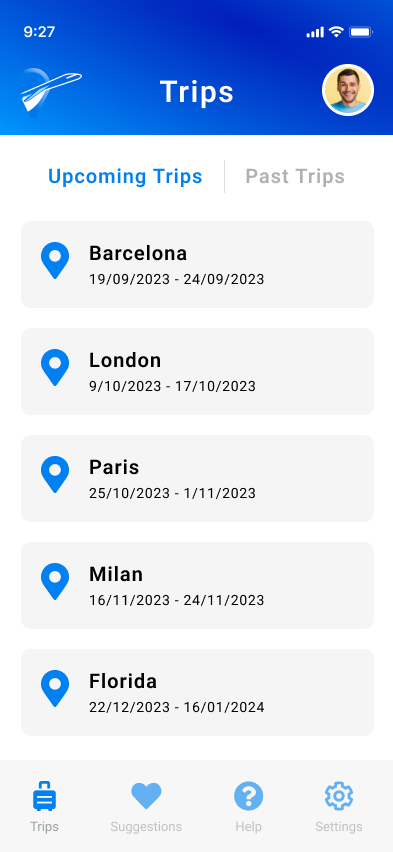
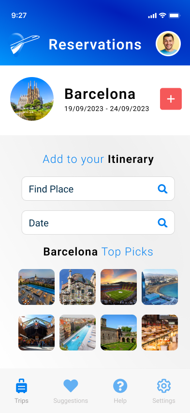

# O'Reilly Architecture Katas 2023

Team Members:  
- Karl Farrugia
- Romario Grech
- Nathan Povo
- Steve Stellini
- Muhammad Hamid Mughal

## Contents
- [Prelude](#prelude)  
- [Non-functional Requirements](#non-functional-requirements)
- [Overall Platform Context](#overall-platform-context)
- [User Experience](#user-experience)
- [Assumptions](#assumptions)
- [User Roles](#user-roles)
- [Actor Diagram](#actor-diagram)
- [Identifying Architectural Quanta](#identifying-architectural-quanta)
- [Overall Architecture](#overall-architecture)
- [Platform Roadmap](#platform-roadmap)
- [Engineering Practices](#engineering-practices)
- [ADRs](#adrs)
- [Resources](#resources)
- [Our 3rd party integrations](#our-3rd-party-integrations)
  
## Prelude

*Described a background of the problem, the use case, and the end goal of the solution.*

## Non-functional Requirements

*The team performed an analysis of business requirements (listed down requirement by requirement, and their observations), NFR for each one, and then in the main section just submitted a list of NFRs encompassing all of them. The team did some additional research on the background of the business entities involved, to finetune the NFRs for their needs (e.g. the business case concerned non-profit organisations, so it made sense to focus on feasibility all throughout the system).*

## Overall Platform Context

The event storming process was employed to identify essential "domain events" within a system, where each event represents an action related to a business entity. It's a crucial initial step as these events configure the central artifact for the system. Event storming meetings start with participants noting domain events, foundational for defining business rules. The team wrote down domain events, each represented on an orange sticky note on a virtual whiteboard. This collaborative approach facilitates comprehensive understanding and mapping of system events for stakeholders.

_To be updated_

Following the identification of domain events, the next step involves pinpointing the commands and users responsible for triggering these events. Commands are actions initiating these events. External actors' commands are explicitly recognized, while some commands originate internally. Post-it notes are arranged to visualize a sequence: actor, command, and event, ensuring a cohesive representation of the system's flow. This step streamlines the understanding of event triggers and user interactions.   These commands and domain events are grouped into related aggregates.

_To be updated_

In the final step, post-gathering domain events and defining triggering commands, the focus shifts to automation policies. These policies apply to commands lacking external actors, activated upon the completion of specific domain events, signifying communication ties between bounded contexts. By grouping semantically related aggregates, we define bounded contexts. Visualized in a diagram, these boundaries and event-driven connections take shape.

_Insert final diagram_

## User Experience

*Section name a bit misleading, here they submitted linear (happy path) processes of end users going through the process.* 

## Assumptions

*Some general assumptions to take everything into context, and give more sense to the narrative.* 

## User Roles

*System user roles.* 

## Actor Diagram

## Identifying Architectural Quanta

*Listing all architecture components and supporting services. For each one, they submitted an architecture diagram, depicting essentially from front-end to back, including external sevices, DB, API/Messaging/Communication style, etcetera.* 

## Overall Architecture

*Logical and Physical view of the Entire System. The Physical View shows the whole picture of each component shown in Identifying Architectural Quanta.* 

## Platform Roadmap

*Section detailing an ideal roadmap, with their suggestion top provide an MVP and then ultimately expand the project in the long term.* 

## Engineering Practices

*References to engineering techniques or design patterns they are considering as part of their implementation. Basic descriptions on each one.* 

## ADRS

*ADRs*

## User Interface Mockups

_Insert brief write-up_

## Resources

*Links to relevant resources.* 

[Introducing event storming](http://ziobrando.blogspot.com/2013/11/introducing-event-storming.html)

### Our 3rd party integrations

*how/what do they support (this will dictate potentially some of our decisions re. the 5 minute)* 
