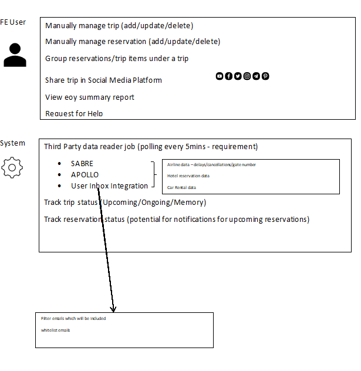

# Slides Breakdown – what we need?

-	Requirements | Use Cases | Story Cards | DDD event-storm output | anything else?
-	Archi Characteristics
    -	Availability
    -	Reliability
    -	Security
    -	Scalability
    -	Elasticity
    -	Deploy ability
    -	Performance
    -	View Others
-	Apply Architecture Characteristics within our requirements (why and how). What characteristic will be sacrificed for another etc.
-	Component Identification - System entities
-	Avoid the entity trap – trip manager (too vague)
-	Workflow Approach – Happy paths for specific scenarios (modules that will handle these workflows)  
-	Actor/Action Approach – Main actors (User – What user can do in the system map)
-	Diagram/Detailed Diagram how components/handlers communicate together.
-	Review Judges Criteria
-	Previous submissions (we say this already)
-	explain Why rather than How
-	ADRs (Title, Status, Context, Decision (the why), Consequences)

## Breaking down the requirement slides

To comprehensively address the requirement outlined in the brief, it is crucial to break it down into specific entry points and clearly define the payloads we will receive from each of these entry points. This meticulous approach ensures that we understand and manage the data flow effectively. 

Delving deeper into this process:

1. User Registration:

    - Entry Point: The user registration page on the website or mobile app.
    - Payload: User-provided information such as name, email, username, and password.

2. User Login:

    - Entry Point: The login page or API endpoint for authentication.
    - Payload: User credentials, typically comprising a username/email and password.

3. Booking Reservations:

    - Entry Point: Online reservation systems or APIs for flights, hotels, and activities.
    - Payload: Reservation details including dates, times, locations, and confirmation numbers.

4. Profile Updates:

    - Entry Point: User profile settings in the app or website.
    - Payload: User-modified data, such as profile picture, contact information, or travel preferences.

5. Trip/Reservation Creation:

    - Manual Creation
        - Entry Point: A feature allowing users to create and organize trips and reservations.
        - Payload: User-generated trip data, which includes trip names, descriptions, and associated reservations.
    
    - Automated Creation Email 
        - Entry Point: Automated creation of trips or reservations by listening to incomping emails.
        - Payload: System-generated trip data, which includes trip names, descriptions, and associated reservations based off email content.

6. Trip/Reservation Updates:

    - Manual Updates
        - Entry Point: A feature allowing users to manually update trips and reservations.
        - Payload: User-generated trip data, and manually outlined associated reservations based off email content.   
    
    - Automated Email 
        - Entry Point: Automated creation of trips or reservations by listening to incomping emails.
        - Payload: System-generated data and automatically outlined associated reservations based off email content.   

    - Third-Party Integration 
        - Entry Point: Polling of third-party services to scan for updates to reservations.
        - Payload: System-generated data and automatically outlined associated reservations based off polled content.    

7. Itinerary Viewing:

    - Entry Point: The user's dashboard displaying their trip itineraries.
    - Payload: Itinerary information, aggregating reservations for a specific trip.

8. Trip Sharing:

    - Entry Point: The user shares a trip which is the accessed by other user's who can then join the trip
    - Payload: Itinerary information, aggregating reservations for a specific trip.
    
9. Data Analytics:

    - Entry Point: Backend analytics processes that examine user behaviour and preferences.
    - Payload: Analytical data, such as usage statistics, user interactions, and travel patterns.

10. Recommendation Engine:

    - Entry Point: The recommendation engine component of the system.
    - Payload: User data used for analysis, which includes historical travel data, preferences, and behaviour.

By breaking down the requirement into these distinct entry points and their associated payloads, we can ensure that we have a clear understanding of where data enters the system and what information is being processed. This structured approach not only aids in the design and development of the system but also lays the foundation for effective data management, security, and the eventual implementation of analytics and recommendation features.

## Performance Characteristics

- Updates must be in the app within 5 minutes of an update (better than the competition). This may be tackled with having the latest updates locally and at the core but have eventual consistency across different regions.
- The system may be composed in 2: 
    - Core services - A stand alone kubernetes cluster which is hosted in the region of the business' core user base.
        - Different components have different loads
    - Globally distributed APIs to service read/write operations to their user base.
        - Different loads in different regions
        - Each region will have its own peak, which may be seasonal (summer holidays) or on weekly trends (weekend getaways)

## Component Identification (Boundary Analysis)

Our solution adheres to a boundary analysis that encompasses several key components to ensure its functionality and effectiveness:

- Trips and Reservations: At the core of our system lies the ability to manage trips and reservations seamlessly. Users can create, update, and view their travel itineraries, which include flights, hotels, and activity reservations.

- Polling Mechanism: To keep information up-to-date, our solution employs a polling mechanism. It regularly checks external sources such as booking platforms for any changes or updates to reservations and synchronizes them with the user's itinerary.

- Email Webhooks: For real-time communication and updates, our system integrates with email webhooks. Users receive notifications and updates about their reservations directly in their email, ensuring they stay informed and can make timely adjustments to their plans.

- Data Analytics: The solution incorporates data analytics to derive insights from user interactions, helping to improve user experiences and provide personalized recommendations based on historical travel data.

- Recommendation Engine: Utilizing a recommendation engine, our system offers tailored suggestions to users based on their travel history, preferences, and current bookings, enhancing their travel planning and decision-making process.

- User Authentication: Security is paramount, and our system includes robust user authentication mechanisms to protect user data and ensure only authorized access to accounts and itineraries.

- Third-party Integrations: We integrate with various third-party services and APIs for booking and reservation data, enabling users to seamlessly import and manage their travel information.

By adhering to this boundary analysis, our solution provides a comprehensive and user-centric travel management experience, ensuring efficiency, accuracy, and user satisfaction throughout the journey planning process.

## Actor & Action Analysis

The identified actors and their actions are as follows:

| Actor          | Actions |
| -------------- | ------- |
| Customer (Authenticated)      | - Registers on the platform  - Logs in the platform  - Consent to email forwarding  - View upcoming trips  - Manage upcoming trips  - View trip reservations  - Manage trip reservations  - Receives notifications regarding upcoming trips  - View personalised analytics  - Request for help from agency  - Share trip details on preferred social media platform  - Share trip details with platform  - Share trip details with anonymous user  |
| Customer (Not Authenticated) | - View shared Trip Summary|
| System Admin   | - Registers on the platform  - Logs in the platform  - Add multi-lingual translations   - View regional analystics   |

## Workflow Approach 

## Merging Users and workflows 

