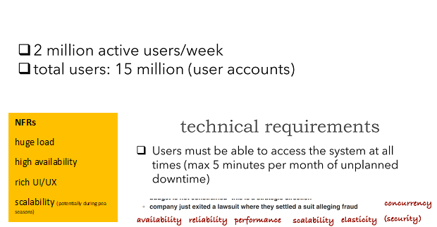

Slides Breakdown – what we need?

•	Requirements | Use Cases | Story Cards | DDD event-storm output | anything else?
•	Archi Characteristics
    o	Availability
    o	Reliability
    o	Security
    o	Scalability
    o	Elasticity
    o	Deploy ability
    o	Performance
    o	View Others
•	Apply Archi Characteristics within our requirements (why and how). What characteristic will be sacrificed for another etc.
•	Component Identification - System entities
•	Avoid the entity trap – trip manager (too vague)
•	Workflow Approach – Happy paths for specific scenarios (modules that will handle these workflows)  
•	Actor/Action Approach – Main actors (User – What user can do in the system map)
•	Diagram/Detailed Diagram how components/handlers communicate together.
•	Review Judges Criteria
•	Previous submissions (we say this already)
•	explain Why rather than How
•	ADRs (Title, Status, Context, Decision (the why), Consequences)

 

 

FE User
 

System
   
