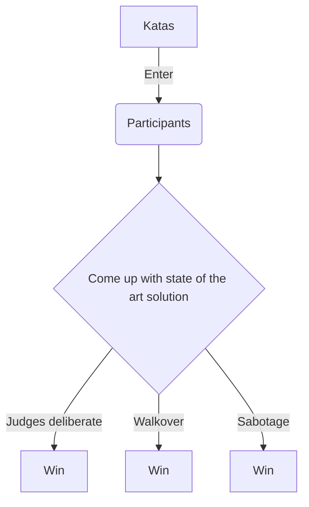

Use Cases
- flowcharts 
- relationship diagrams 
- component diagrams
- context diagrams
- user journey diagrams sequence diagrams 
- User Story Mapping 
- System level diagrams 
- deployment diagrams 
- ui diagrams
- behaviour
- db diagrams
- actor diagram
- domain model
- user story mapping

Tools
- Visio
- MIRO / Microsoft Whiteboard
- [ok so app](https://okso.app/)
- [mermaid diagrams](http://mermaid.js.org/)
- draw.io
- mockflow

References
- [Developer To Architect](https://developertoarchitect.com/resources.html)

