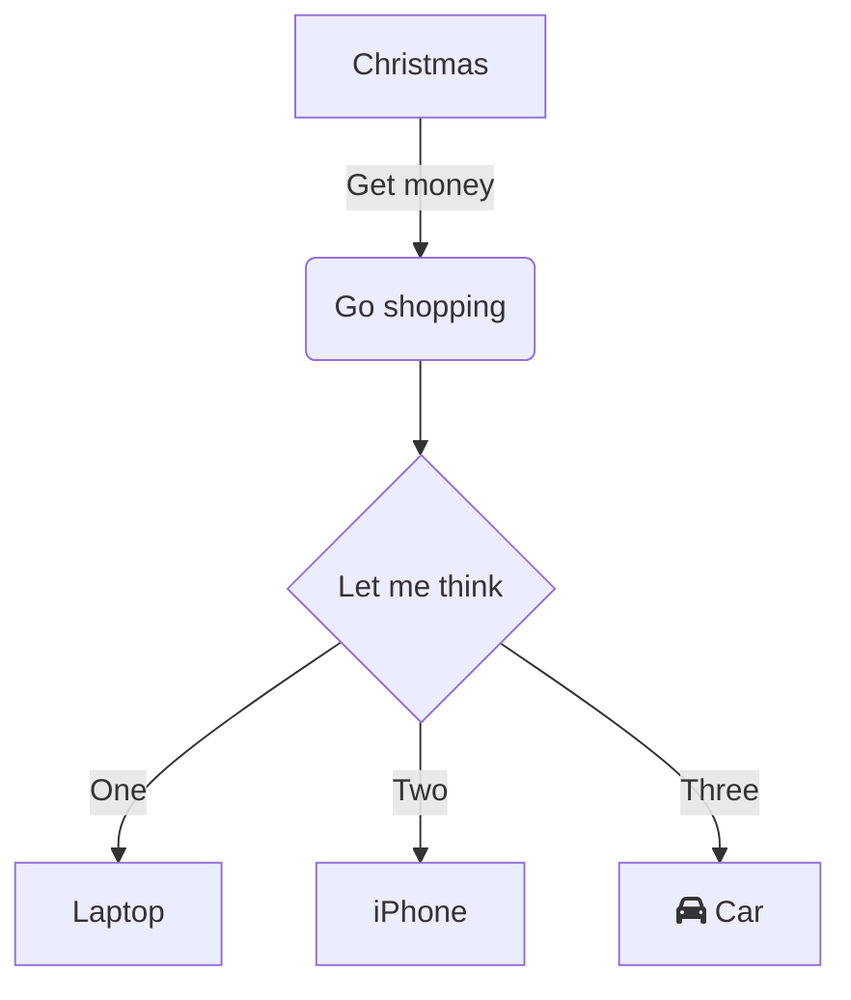

Use Cases
- flowcharts - mermaid
- relationship diagrams - mermaid
- component diagrams
- context diagrams
- user journey diagrams sequence diagrams - mermaid
- User Story Mapping - miro
- System level diagrams - visio
- deployment diagrams - visio
- ui diagrams
- behaviour - mermaid
- db diagrams

Tools
- Visio
- MIRO / Microsoft Whiteboard
- [ok so app](https://okso.app/)
- [mermaid diagrams](http://mermaid.js.org/)

