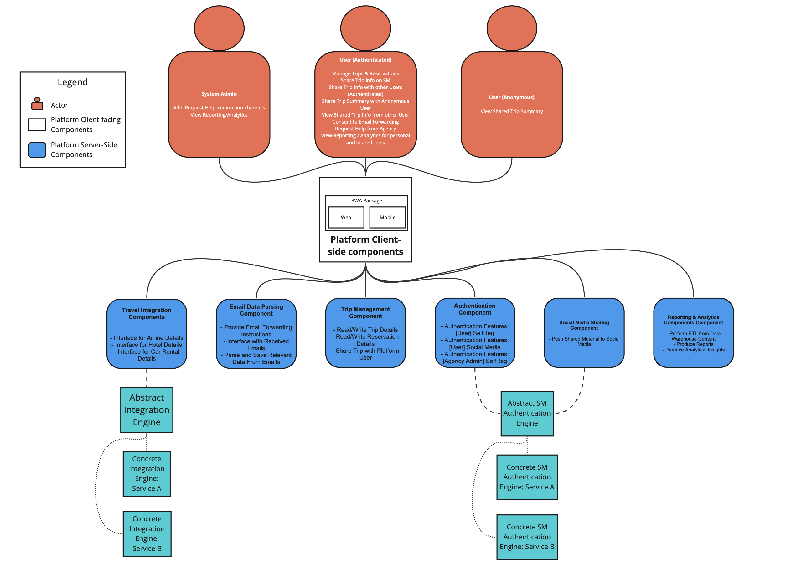

# High-level Platform Context Diagram

The below context diagram provides a high-level introduction into actions that the different User types can perform on the application. The abstractions of the different components (or services) responsible for handling all possible actions triggered by users or external interfaces.

